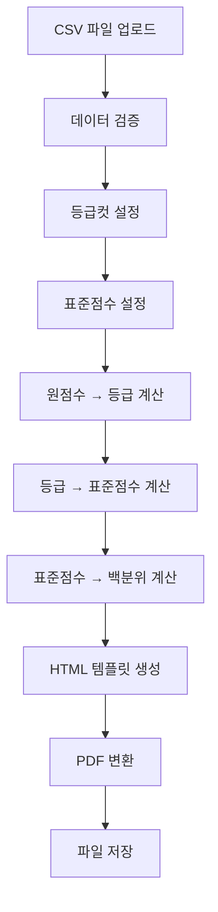

# 시험지 생성 프로그램 개발 가이드라인

## 📋 프로젝트 개요

### 목적
- 선생님들이 학생 성적을 관리하고 PDF 성적표를 자동 생성하는 프로그램
- CSV/Excel 파일로 학생 성적 데이터를 업로드하여 개별 PDF 성적표 생성
- 등급컷, 표준점수, 백분위 자동 계산

### 주요 기능
1. **GUI 기반 파일 업로드**: 과목별 CSV/Excel 파일 업로드
2. **등급컷 및 표점 입력**: GUI에서 직접 등급컷과 표준점수 입력
3. **등급컷 CSV 업로드**: 미리 준비된 등급컷 CSV 파일로 일괄 설정
4. **자동 계산**: 원점수 → 등급 → 표준점수 → 백분위 변환
5. **HTML 기반 PDF 생성**: 브라우저 자동 제어로 PDF 저장
6. **스크롤 가능한 GUI**: 긴 내용도 스크롤하여 확인 가능
7. **샘플 데이터 생성**: 테스트용 CSV 파일 자동 생성

## 🏗️ 프로젝트 구조

```
scoring system/
├── main.py                    # 메인 GUI 프로그램
├── data_processor.py          # 데이터 처리 및 계산 로직
├── html_pdf_generator.py      # HTML → PDF 변환 (브라우저 자동 제어)
├── simple_pdf_generator.py    # ReportLab 기반 PDF 생성 (대안)
├── create_grade_cutoff_csv.py # 등급컷 CSV 파일 생성
├── sample_data.py             # 샘플 데이터 생성
├── test_sample_pdf.py         # 샘플 PDF 테스트
├── requirements.txt           # 필요한 패키지 목록
├── sample_output/             # 생성된 PDF 저장 폴더
├── 등급컷_표점_데이터.csv      # 등급컷 및 표점 데이터
├── 샘플_학생_데이터.csv        # 샘플 학생 데이터
├── 과목코드.csv               # 과목 코드 매핑
└── 개발가이드라인.md          # 이 파일
```

## 📦 필요한 패키지

### requirements.txt
```
pandas>=1.3.0
tkinter
reportlab>=3.6.0
weasyprint>=54.0
pdfkit>=1.0.0
selenium>=4.0.0
playwright>=1.20.0
```

### 설치 방법
```bash
pip install -r requirements.txt
playwright install chromium
```

## 🔧 핵심 컴포넌트

### 1. main.py - GUI 메인 프로그램

#### 주요 클래스: `ScoringSystemGUI`
```python
class ScoringSystemGUI:
    def __init__(self, root):
        # GUI 초기화
        self.setup_gui()
    
    def setup_gui(self):
        # 스크롤 가능한 메인 프레임 생성
        # PDF 제목 입력 필드
        # 과목별 파일 업로드 섹션
        # 등급컷 및 표점 입력 탭
        # 처리 버튼들
```

#### 주요 기능:
- **스크롤 가능한 GUI**: `Canvas`와 `Scrollbar` 사용
- **탭 기반 입력**: `ttk.Notebook`으로 과목별 등급컷 입력
- **파일 업로드**: CSV/Excel 파일 선택 및 검증
- **등급컷 CSV 업로드**: 미리 준비된 등급컷 CSV 파일로 일괄 설정
- **샘플 데이터 생성**: 테스트용 CSV 파일 자동 생성
- **데이터 처리**: 등급컷, 표준점수, 백분위 계산

### 2. data_processor.py - 데이터 처리 로직

#### 주요 클래스: `DataProcessor`
```python
class DataProcessor:
    def __init__(self):
        self.subject_data = {}
        self.grade_cutoff_data = None
        self.standard_scores = {}
        self.grade_standard_scores = {}
```

#### 핵심 메서드:
- `load_subject_data()`: CSV/Excel 파일 로드
- `set_grade_cutoff_data()`: 등급컷 데이터 설정
- `set_standard_scores()`: 표준점수 데이터 설정
- `process_all_data()`: 전체 데이터 처리 및 계산

#### 계산 로직:
```python
def _calculate_grade_from_cutoffs(self, score, grade_cutoffs):
    """등급컷을 사용한 등급 계산 (1-9등급)"""
    for grade in range(1, 10):
        if score >= grade_cutoffs.get(grade, 0):
            return grade
    return 9

def _calculate_standard_score_and_percentile_new(self, score, grade, grade_cutoffs, max_standard_score):
    """표준점수 및 백분위 계산 (등급별 표점 사용)"""
    # 한국사와 영어는 표점과 백분위 없음
    if max_standard_score == 0:
        return None, None
    
    # 등급별 표준점수 사용한 선형 보간 계산
    # ...
```

### 3. html_pdf_generator.py - PDF 생성

#### 주요 클래스: `HTMLPDFGenerator`
```python
class HTMLPDFGenerator:
    def generate_html_based_pdf(self, student_data, output_dir, pdf_title):
        """HTML 템플릿 기반 PDF 자동 생성 (브라우저 자동 제어)"""
        # Playwright를 사용한 브라우저 자동 제어
        # Ctrl+P → PDF 저장 자동화
        # 실패 시 HTML 파일로 폴백
```

#### HTML 템플릿 특징:
- **원본 디자인**: `scoring templete` 파일과 동일한 레이아웃
- **반응형 테이블**: 컬럼 너비 조정으로 텍스트 1줄 표시
- **인쇄 최적화**: A4 크기, 적절한 여백 설정

## 📊 데이터 구조

### CSV 파일 형식
```csv
이름,선택과목,선택과목코드,총점,정답수,오답번호
김철수,언어와 매체,05,92,25,"2, 9, 14"
이영희,미적분,28,88,22,"6, 12"
```

### 과목 코드 매핑 (최신)
```python
subject_codes = {
    # 국어 영역
    "국어": "01", "언어와 매체": "05", "화법과 작문": "06",
    # 수학 영역
    "수학": "02", "확률과 통계": "03", "미적분": "04", "기하": "09",
    # 언어 영역
    "영어": "07",
    # 한국사
    "한국사": "08",
    # 사회탐구 영역
    "생활과 윤리": "11", "윤리와 사상": "12", "한국지리": "13", "세계지리": "14",
    "동아시아사": "15", "세계사": "16", "경제": "17", "정치와 법": "18", "사회·문화": "19",
    # 과학탐구 영역
    "물리학 I": "21", "화학 I": "22", "생명과학 I": "23", "지구과학 I": "24",
    "물리학 II": "25", "화학 II": "26", "생명과학 II": "27", "지구과학 II": "28"
}
```

## 🎯 특별한 과목 처리

### 1. 영어와 한국사
- **고정 등급컷**: 영어(90,80,70...), 한국사(40,35,30...)
- **표점/백분위 없음**: `max_standard_score = 0`으로 설정
- **등급만 계산**: 표준점수와 백분위는 "—"로 표시

### 2. 사탐과 과탐
- **50점 만점**: 원점수는 50점 기준
- **표점 100점**: 표준점수는 100점 만점 가능
- **등급컷**: 47, 43, 39, 35, 31, 27, 23, 19, 15점

## 🖥️ GUI 구성

### 메인 레이아웃
```
┌─────────────────────────────────────┐
│ 제목: 성적 관리 시스템              │
├─────────────────────────────────────┤
│ PDF 성적표 제목: [입력필드]         │
├─────────────────────────────────────┤
│ 과목별 성적 파일 업로드             │
│ 국어: [파일선택] 수학: [파일선택]   │
│ 영어: [파일선택] 한국사: [파일선택] │
│ 탐구1: [파일선택] 탐구2: [파일선택] │
├─────────────────────────────────────┤
│ 등급컷 및 표점 데이터 입력 (탭)      │
│ [국어] [수학] [영어] [한국사]       │
│ [사회탐구] [과학탐구]               │
├─────────────────────────────────────┤
│ [데이터 처리] [PDF 생성] [CSV 샘플] [등급컷 CSV 업로드] │
├─────────────────────────────────────┤
│ 결과 로그 (스크롤 가능)             │
└─────────────────────────────────────┘
```

### 탭 구성
각 탭마다 다음 입력 필드 제공:
- **등급컷**: 1등급~9등급 컷오프 점수
- **만점 표점**: 해당 과목의 최대 표준점수
- **등급별 표점**: 각 등급별 표준점수

## 🔄 데이터 처리 흐름



## 🛠️ 개발 시 주의사항

### 1. 파일 인코딩
- 모든 파일은 `utf-8-sig` 인코딩 사용
- CSV 파일 읽기/쓰기 시 인코딩 명시

### 2. 에러 처리
```python
try:
    # PDF 생성
    pdf_generator.generate_html_based_pdf(...)
except Exception as e:
    # HTML 폴백
    self._create_html_fallback(...)
```

### 3. GUI 스크롤
```python
# 스크롤 가능한 프레임 생성
canvas = tk.Canvas(self.root)
scrollbar = ttk.Scrollbar(self.root, orient="vertical", command=canvas.yview)
scrollable_frame = ttk.Frame(canvas)

# 마우스 휠 이벤트 바인딩
def _on_mousewheel(event):
    canvas.yview_scroll(int(-1*(event.delta/120)), "units")
canvas.bind_all("<MouseWheel>", _on_mousewheel)
```

### 4. HTML 템플릿 수정
- 원본 `scoring templete` 파일과 동일한 구조 유지
- 컬럼 너비 조정으로 텍스트 1줄 표시
- CSS 스타일 변경 시 인쇄 최적화 고려

## 🧪 테스트 방법

### 1. 등급컷 CSV 파일 생성
```bash
python create_grade_cutoff_csv.py
```

### 2. 샘플 데이터 생성
```bash
python sample_data.py
```

### 3. 샘플 PDF 생성
```bash
python test_sample_pdf.py
```

### 4. GUI 실행
```bash
python main.py
```

### 5. 등급컷 CSV 업로드 테스트
1. GUI에서 "등급컷 CSV 업로드" 버튼 클릭
2. `등급컷_표점_데이터.csv` 파일 선택
3. 모든 과목의 등급컷과 표점이 자동으로 입력됨

## 📝 확장 가능성

### 1. 새로운 과목 추가
- `subject_codes` 딕셔너리에 과목 코드 추가
- GUI 탭에 새로운 과목 카테고리 추가

### 2. 계산 로직 수정
- `_calculate_standard_score_and_percentile_new()` 메서드 수정
- 새로운 등급 계산 방식 추가

### 3. PDF 템플릿 수정
- `html_pdf_generator.py`의 `_create_html_template()` 메서드 수정
- 새로운 레이아웃이나 스타일 추가

## 🚀 배포 방법

### 1. 실행 파일 생성
```bash
python -m PyInstaller --onefile --windowed --name="ScoringSystem" main.py
```

### 2. 필요한 파일 포함
- `requirements.txt`
- `sample_*.csv` 파일들
- `scoring templete` 파일

## 🔍 문제 해결

### 1. PDF 생성 실패
- Playwright 설치 확인: `playwright install chromium`
- 브라우저 자동 제어 실패 시 HTML 폴백 파일 확인
- 파일 권한 확인

### 2. 한글 인코딩 문제
- 모든 파일을 `utf-8-sig` 인코딩으로 저장
- CSV 파일 읽기 시 `encoding='utf-8-sig'` 사용

### 3. GUI 스크롤 문제
- `canvas.configure(scrollregion=canvas.bbox("all"))` 확인
- 마우스 휠 이벤트 바인딩 확인

## 📚 참고 자료

- [tkinter 공식 문서](https://docs.python.org/3/library/tkinter.html)
- [pandas 공식 문서](https://pandas.pydata.org/docs/)
- [Playwright 공식 문서](https://playwright.dev/python/)
- [ReportLab 공식 문서](https://www.reportlab.com/docs/reportlab-userguide.pdf)

---

## 🆕 최신 업데이트 (2025-10-18)

### 추가된 기능
1. **등급컷 CSV 업로드 기능**: 미리 준비된 등급컷 CSV 파일로 일괄 설정
2. **브라우저 자동 PDF 저장**: Playwright를 사용한 자동 PDF 저장
3. **샘플 데이터 자동 생성**: 테스트용 CSV 파일 자동 생성
4. **과목 코드 중복 해결**: 수학과 과학탐구 영역 코드 분리
5. **HTML 템플릿 개선**: 생년월일, 성별, 시도 필드 비우기
6. **원점수 정수 표시**: 100.0 → 100으로 표시

### 수정된 파일
- `main.py`: 등급컷 CSV 업로드 기능 추가
- `html_pdf_generator.py`: 브라우저 자동 제어 PDF 생성
- `create_grade_cutoff_csv.py`: 등급컷 CSV 파일 생성기
- `data_processor.py`: 과목 코드 중복 해결

---

**개발자**: AI Assistant  
**최종 수정일**: 2025-10-18  
**버전**: 2.0.0
